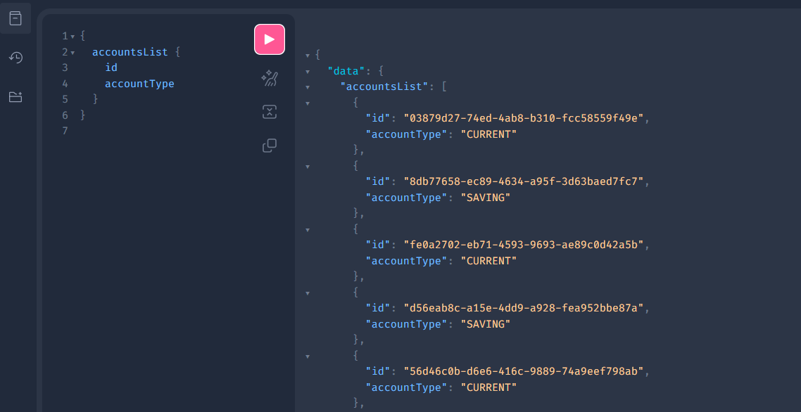
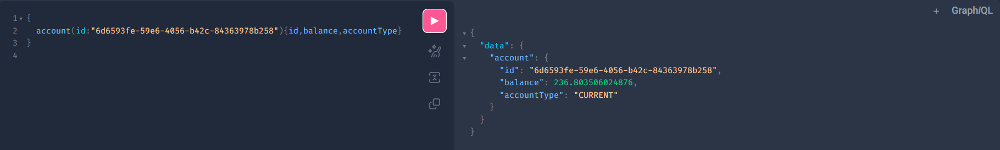
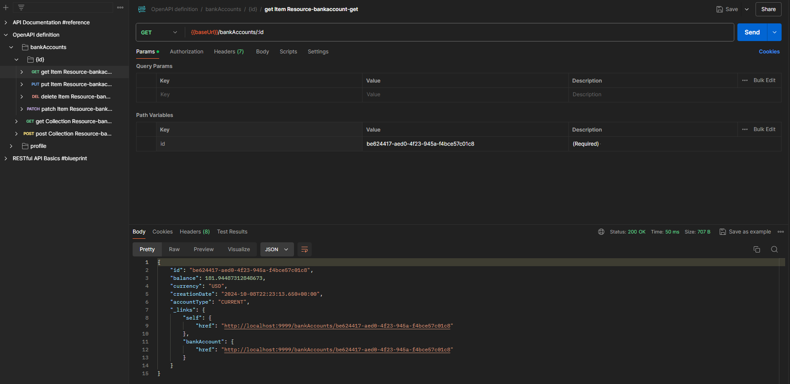
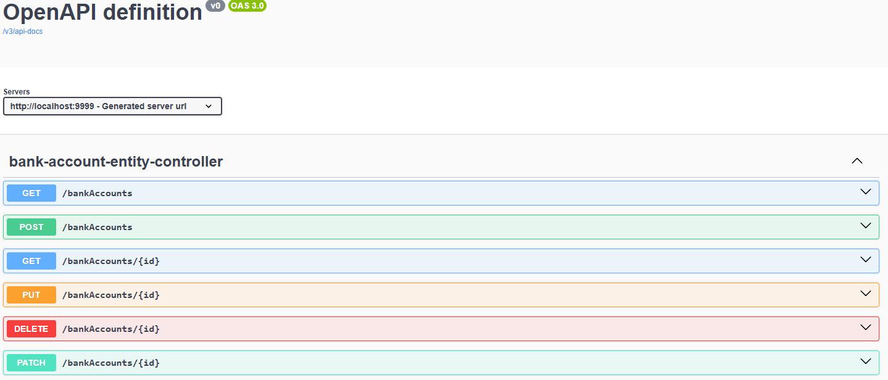

# Projet Spring Boot avec GraphQL

Ce projet est une application Spring Boot qui expose une API GraphQL pour la gestion de comptes bancaires. Il permet d'effectuer des opérations CRUD (Create, Read, Update, Delete) sur les comptes bancaires en utilisant GraphQL.

## Fonctionnalités

- **API GraphQL** complète pour la gestion des comptes bancaires.
- **Opérations CRUD** :
    - Création d'un nouveau compte bancaire.
    - Lecture des comptes bancaires.
    - Mise à jour d'un compte bancaire existant.
    - Suppression d'un compte bancaire.
- **Interface GraphiQL** intégrée pour tester les requêtes GraphQL.
- **Validation des entrées** et gestion des erreurs.
- **Documentation Swagger** pour les endpoints REST.

## Prérequis

Assurez-vous d'avoir les outils suivants installés sur votre machine :

- **Java 17** ou supérieur
- **Maven 3.6** ou supérieur
- **Git** (facultatif, pour cloner le dépôt)

## Installation

1. **Cloner le dépôt du projet :**

   ```bash
   git clone https://github.com/ELMOUADDIBE/Demo-Spring-GraphQL.git
   cd demo-spring-graphql
   ```

2. **Construire le projet avec Maven :**

   ```bash
   mvn clean install
   ```

## Démarrage de l'application

1. **Exécuter l'application Spring Boot :**

   ```bash
   mvn spring-boot:run
   ```

2. **Accéder à l'application :**

   L'application sera disponible à l'adresse : `http://localhost:9999`

## Utilisation de l'API GraphQL

### Endpoint GraphiQL

GraphiQL est une interface web interactive qui permet de tester les requêtes GraphQL.

- **URL d'accès à GraphiQL :**

  ```
  http://localhost:9999/graphiql?path=/graphql
  ```

  

### Exemples de requêtes GraphQL

#### Obtenir la liste des comptes bancaires

**Requête :**

```graphql
query {
  accountsList {
    id
    accountType
    balance
    currency
    creationDate
  }
}
```

**Réponse attendue :**

```json
{
  "data": {
    "accountsList": [
      {
        "id": "123e4567-e89b-12d3-a456-426614174000",
        "accountType": "CURRENT",
        "balance": 2500.0,
        "currency": "USD",
        "creationDate": "2023-10-10T12:34:56.789Z"
      }
      // Autres comptes...
    ]
  }
}
```

**Exemple dans GraphiQL :**



#### Obtenir un compte bancaire par ID

**Requête :**

```graphql
query {
  account(id: "123e4567-e89b-12d3-a456-426614174000") {
    id
    accountType
    balance
    currency
    creationDate
  }
}
```

#### Ajouter un nouveau compte bancaire

**Mutation :**

```graphql
mutation {
  addAccount(accountInput: {
    accountType: CURRENT,
    balance: 1000.0,
    currency: "EUR"
  }) {
    id
    accountType
    balance
    currency
    creationDate
  }
}
```

#### Mettre à jour un compte bancaire

**Mutation :**

```graphql
mutation {
  updateAccount(
    id: "123e4567-e89b-12d3-a456-426614174000",
    accountInput: {
      accountType: SAVINGS,
      balance: 1500.0,
      currency: "USD"
    }
  ) {
    id
    accountType
    balance
    currency
    creationDate
  }
}
```

#### Supprimer un compte bancaire

**Mutation :**

```graphql
mutation {
  deleteAccount(id: "123e4567-e89b-12d3-a456-426614174000")
}
```

**Réponse attendue :**

```json
{
  "data": {
    "deleteAccount": true
  }
}
```

## Tests de l'API avec Postman

Vous pouvez également tester l'API GraphQL en utilisant **Postman** :

1. **Créer une nouvelle requête POST** vers l'URL :

   ```
   http://localhost:9999/graphql
   ```

2. **Dans l'onglet "Body"**, sélectionner **"GraphQL"**.

3. **Entrer votre requête ou mutation GraphQL** dans le champ prévu.

4. **Envoyer la requête** et consulter la réponse.

**Exemple avec Postman :**



## Documentation Swagger

Si votre projet inclut des endpoints REST et que vous avez configuré Swagger, vous pouvez accéder à la documentation interactive :

- **URL d'accès à Swagger UI :**

  ```
  http://localhost:9999/swagger-ui.html
  ```

**Exemple de Swagger UI :**



## Structure du projet

```
src/
├── main/
│   ├── java/
│   │   └── ma/enset/accountservice/
│   │       ├── controllers/
│   │       │   └── AccountGraphQLController.java
│   │       ├── dto/
│   │       │   └── BankAccountInput.java
│   │       ├── entities/
│   │       │   └── BankAccount.java
│   │       ├── enums/
│   │       │   └── AccountType.java
│   │       ├── repositories/
│   │       │   └── BankAccountRepository.java
│   │       └── AccountServiceApplication.java
│   └── resources/
│       ├── application.properties
│       └── schema.graphqls
└── test/
    └── java/
        └── ma/enset/accountservice/
            └── AccountServiceApplicationTests.java
```

## Technologies utilisées

- **Java 17**
- **Spring Boot**
- **Spring Data JPA**
- **Spring for GraphQL**
- **Lombok**
- **Hibernate**
- **H2 Database** (ou autre SGBD de votre choix)
- **GraphiQL** pour l'interface de test GraphQL
- **Swagger** pour la documentation des endpoints REST
- **Postman** pour les tests d'API